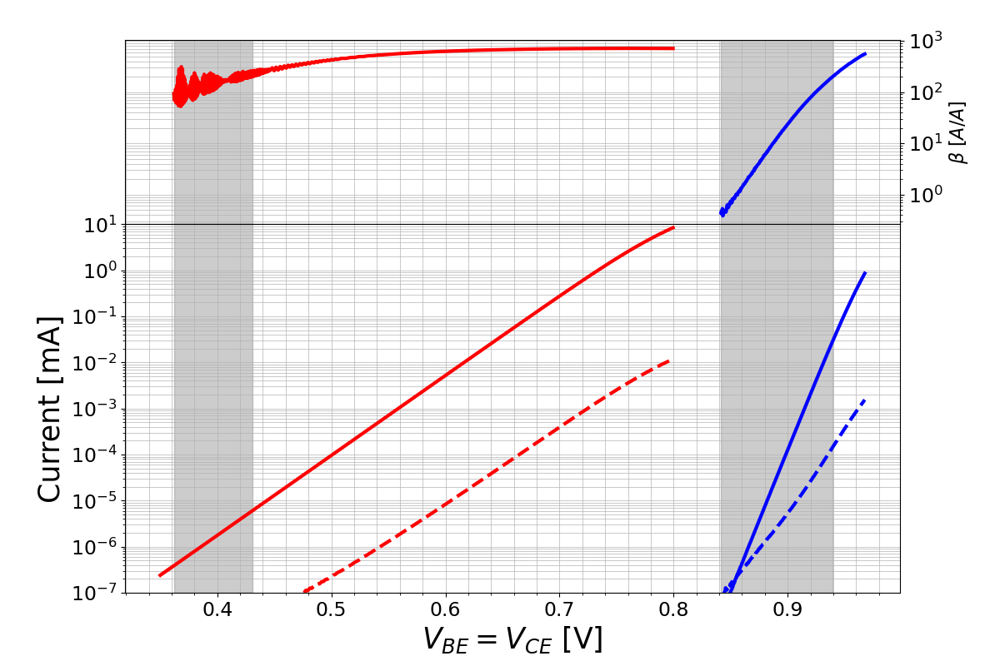

# BJT Characterization: Gummel Plot Analysis

This repository contains Python scripts for generating Gummel plots to 
characterize Bipolar Junction Transistors (BJTs) at different operating 
temperatures. The analysis focuses on the relationship between the 
base-emitter voltage ($V_{BE}$) and the resulting collector ($I_C$) and 
base ($I_B$) currents, as well as the current gain ($\beta$).

## Gummel Plot: Cryogenic vs. Room Temperature

The plot below shows the simulated BJT performance at both room 
temperature (e.g., 300K) and cryogenic temperature (e.g., 77K). The top 
panel displays the current gain ($\beta$), while the bottom panel shows 
the collector and base currents on a logarithmic scale.

### Key Features of the Plot
* **Top Plot**: Current Gain ($\beta$) vs. $V_{BE}$. The y-axis is on the 
right.
* **Bottom Plot**: Collector Current ($I_C$) and Base Current ($I_B$) vs. 
$V_{BE}$. The y-axis is on the left.
* **Seamless Stacking**: The plots are stacked with no vertical space for 
direct comparison.
* **Homogeneous Grid**: A shared x-axis and continuous grid lines aid in 
correlating gain behavior with current levels.

## How to Generate
The plot is generated using a Python script. To reproduce the figure, run 
the main script.

### Dependencies
* **Python 3.x**
* **Matplotlib**
* **NumPy**
